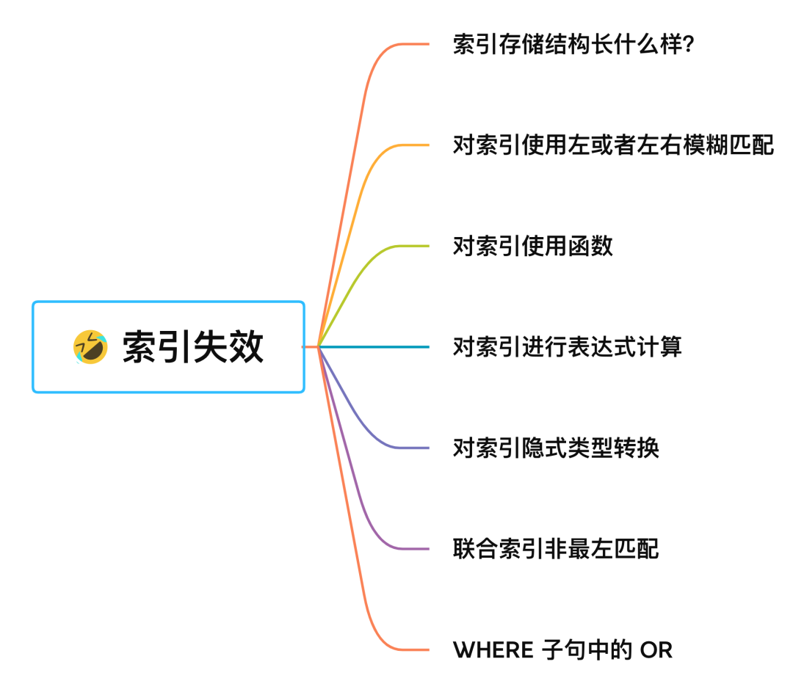

# MySQL

## MySQL 常见字段类型


## mysql 常用语句

```sql
create table `tname`(
	`column_name` type,
  ...
);
```

```sql
insert into `tname` (f1,f2) values (v1,v2);
```

```sql
update tname set f1=v1, f2=v2 [where ...];
```

```sql
delete from tname [where ...];
```

```sql
select f1 from tname where f1 like condition;
```

## mysql 函数

### 字符串

```sql
char_length(str);
concat(str1,str2);
locate(s, str); s in str;
lower(str);
upper(str);
trim(str);
...
```

### 数字

```sql
min(exp);
max(exp);
sum(exp);
avg(exp);
abs(x);
pow(x,y) x^y;
rand() rand num from (0,1);
...
```

### 日期

```sql
curdate();
curtime();
now(); date + time;

year(date); return the year of date;
month(date);
day(date); 
hour(date);
minute(date);
second(date);

adddate(date,days); add days to date;
addtime(time, timeexp); add timeexp to time;
...
```

## 索引失效

1. [6 种失效情况](https://mp.weixin.qq.com/s/lEx6iRRP3MbwJ82Xwp675w)



2. [防止索引失效](https://www.xiaolincoding.com/mysql/index/index_interview.html#防止索引失效)

## [慢查询优化](https://chat.openai.com/c/b37ae682-d06e-48d3-b1d6-2d8fae025ada)

1. 使用 explain 分析执行计划
2. 为经常查询的字段创建索引
3. 尽量避免 select *
4. 调整mysql缓存大小配置，定期检查慢查询日志
5. 硬件升级

## 表连接查询种类及区别

1. 内查询
2. 左外查询
3. 右外查询
4. 全外查询
5. 交叉查询。笛卡尔积

## mybatis xml 标签

1. **\<mapper>**：映射文件的根元素。它通常包含一个或多个 SQL 映射语句。
2. **\<select>**：定义一个 SELECT 语句。
3. **\<insert>**：定义一个 INSERT 语句。
4. **\<update>**：定义一个 UPDATE 语句。
5. **\<delete>**：定义一个 DELETE 语句。
6. **\<sql>**：定义可重用的 SQL 片段。
7. **\<include>**：在其他语句中插入一个 SQL 片段。
8. **\<resultMap>**：描述如何从数据库结果集中加载对象。它可以定义列到字段的映射、关联、集合等。
9. **\<parameterMap>**：虽然现在不推荐使用，但它可以描述传递给语句的参数。
10. **\<typeAliases>**：提供一个类型的别名，使其在 XML 中的引用更加简洁。
11. **\<typeHandlers>**：定义如何转换 Java 类型到 JDBC 类型。
12. 动态 SQL 元素：如 `<if>`, `<choose>`, `<when>`, `<otherwise>`, `<foreach>`, `<set>`, `<trim>`, `<where>`, `<bind>`。这些可以用于构造动态的 SQL 语句。
