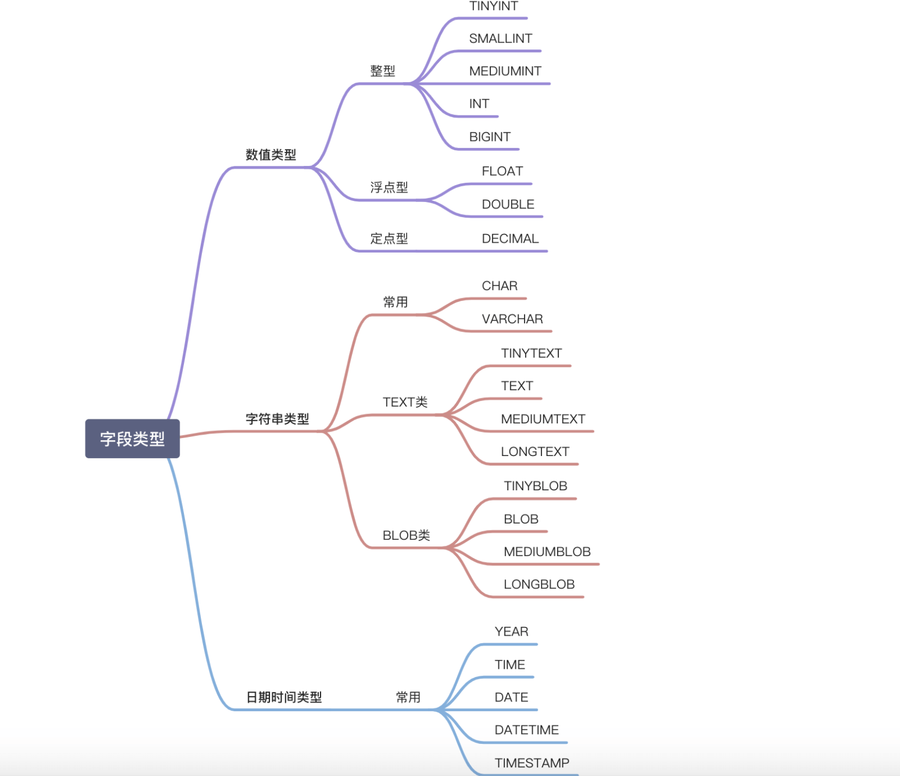

# MySQL

## MySQL 常见字段类型


## MySQL 常用语句
```sql
create table `tname`(
	`column_name` type,
  ...
);
```

```sql
insert into `tname` (f1,f2) values (v1,v2);
```

```sql
update tname set f1=v1, f2=v2 [where ...];
```

```sql
delete from tname [where ...];
```

```sql
select f1 from tname where f1 like condition;
```

## MySQL 函数

### 字符串

```sql
char_length(str);
concat(str1,str2);
locate(s, str); s in str;
lower(str);
upper(str);
trim(str);
...
```

### 数字

```sql
min(exp);
max(exp);
sum(exp);
avg(exp);
abs(x);
pow(x,y) x^y;
rand() rand num from (0,1);
...
```

### 日期

```sql
curdate();
curtime();
now(); date + time;

year(date); return the year of date;
month(date);
day(date); 
hour(date);
minute(date);
second(date);

adddate(date,days); add days to date;
addtime(time, timeexp); add timeexp to time;
...
```

## 表连接查询种类及区别

1. 内查询
2. 左外查询
3. 右外查询
4. 全外查询
5. 交叉查询。笛卡尔积

## MyBatis XML 标签

1. **\<mapper>**：映射文件的根元素。它通常包含一个或多个 SQL 映射语句。
2. **\<select>**：定义一个 SELECT 语句。
3. **\<insert>**：定义一个 INSERT 语句。
4. **\<update>**：定义一个 UPDATE 语句。
5. **\<delete>**：定义一个 DELETE 语句。
6. **\<sql>**：定义可重用的 SQL 片段。
7. **\<include>**：在其他语句中插入一个 SQL 片段。
8. **\<resultMap>**：描述如何从数据库结果集中加载对象。它可以定义列到字段的映射、关联、集合等。
9. **\<parameterMap>**：虽然现在不推荐使用，但它可以描述传递给语句的参数。
10. **\<typeAliases>**：提供一个类型的别名，使其在 XML 中的引用更加简洁。
11. **\<typeHandlers>**：定义如何转换 Java 类型到 JDBC 类型。
12. 动态 SQL 元素：如 `<if>`, `<choose>`, `<when>`, `<otherwise>`, `<foreach>`, `<set>`, `<trim>`, `<where>`, `<bind>`。这些可以用于构造动态的 SQL 语句。

## SQL 执行流程

1. 客户端和服务端的连接：MySQL 登陆，数据库表权限验证
2. 核心层：查询缓存、分析器分析语句、优化器优化语句
3. 存储引擎：执行器调用存储引擎 API 获取数据

## 索引

### 是什么

是一种排好序的数据结构，能够快速检索数据。MySQL 中使用 B+ 树作为索引结构。

### MySQL 索引种类

- 按数据结构：B+ 树、哈希、全文
- 物理存储：
    - 聚簇索引：索引 + 数据，例如 B+ 树中，上面是索引，下面叶子有数据。
    - 二级索引：叶子节点存主键值，不存数据。
- 字段特性：
    - 主键索引（PRIMARY KEY）：非空、列值唯一、表中唯一
    - 唯一索引（UNIQUE KEY）：可为空、值唯一、表中可多个
    - 普通索引（INDEX）：加速查询
    - 联合索引：多列

### 为什么 MySQL 选择 B+ 树

对一个没有使用索引的 MySQL 进行逐步优化，大概是这样的流程：

1. 使用数组，排好序，二分查找，但是
    1. 每次查找需要计算中间位置
    2. 插入新元素性能低。
2. 二分查找树（Binary Search Tree）解决了上述两个问题，但是有一个新的问题，如果每次插入的元素都是最大的元素，或者越来越小，那么 BST 就退化成一条链表了。
3. 自平衡二叉树（Adelson-Velsky and Landis Tree）有左右子树高度差不超过 1 的约束，这样就解决了 BST 退化成链表的问题。但是随着元素增多，树的高度会变高，意味着 I/O 次数多。
4. B 树允许 2 个以上子节点，解决了树过高问题。但是每个节点都存有数据，导致很多不必要的 I/O 操作。
5. B+ 树则数据仅存储在叶子节点，这样不仅减少了不必要的 I/O，也为提高了更新节点的效率。

### [索引失效](https://mp.weixin.qq.com/s/lEx6iRRP3MbwJ82Xwp675w)

1. 左或左右模糊匹配
2. 使用函数（查询索引列）
3. 类型隐式转换（索引列是字符串，查询参数为数字，本质是使用了 CAST 函数）
4. 使用表达式计算（索引列）
5. 联合索引未遵循最左匹配
6. WHERE 子句中，OR 前面是索引列，后面不是索引列

## SQL 优化

### 定位慢查询

1. 使用工具：

    1. 调试工具：Arthas
    2. 运维工具：Prometheus、Skywalking

2. MySQL 自带慢日志

    1. 在 /etc/my.cnf 中写入配置

    ```bash
    # 开启慢日志
    slow_query_log=1
    # 超过 2 秒会被记录
    long_query_time=2
    ```

    2. 在 /var/lib/mysql/localhost-slow.log 中可以查看具体内容

### 优化慢查询

1. 使用 explain 分析执行计划
    1. 通过 key 或 key_len 检查是否命中索引
    2. 通过 type 字段查看是否有进一步优化空间
    3. 通过 extra 判断是否出现了回表的情况，如果出现可以：
        1. 添加索引
        2. 修改返回字段
2. 为经常查询的字段创建索引
3. SQL 语句优化：
    1. 尽量避免 select *
    2. 避免索引失效的写法
    3. 聚合查询尽量用 union all 代替 union，因为 union 多一层重复过滤
    4. 表关联查询 join 的优化，优先使用内连接，外连接要以小表为驱动
    5. 避免 where 中对字段进行表达式操作
4. 主从复制，读写分离
5. 分库分表
6. 调整 MySQL 缓存大小配置，定期检查慢查询日志
7. 硬件升级

## 锁

### 锁的种类

1. 按粒度：
    1. 全局锁
    2. 表级锁
    3. 页级锁
    4. 行级锁
2. 按属性：
    1. 共享锁
    2. 排他锁
3. 按状态：
    1. 意向共享锁
    2. 意向排他锁
4. 按模式：
    1. 乐观锁
    2. 悲观锁

## 事务

### 四大特性

Atomicity：原子性
Consistency：一致性
Isolation：隔离性
Durability：持久性

### 并发事务问题

1. 脏读：读取未提交的数据（A 读取 B 未提交的数据，B 回滚后 A 的数据是脏数据）
2. 不可重复读：一个事务中多次读取的内容不一样
3. 幻读：多行或少行，数据总量不一样
4. 丢失修改：两个事务同时修改，提交后其中一个事务的修改被覆盖

## 事务隔离级别

1. 读未提交（Read uncommitted）：一个事务可以读到另一个事务未提交的数据
2. 读已提交（Read committed）：一个事务要等另一个事务提交后才能读取数据。解决脏读。
3. 可重复读（Repeatable read）：默认隔离级别，一个事务开始读数据时，不允许其他事务修改。解决脏读和不可重复读。
4. 串行化（Serializable）：最高的隔离级别，可以避免所有问题，但是效率低、消耗数据库性能，一般不使用。

## MVCC

### 简介

全称 Multi-Versioin Concurrency Control，多版本并发控制。是解决读写冲突的一种机制。

### 工作原理

1. 读操作
    1. 当事务想要读取数据时，它会读取满足其快照的数据版本。
    2. 一个事务只能看到它开始时（或之前）存在的数据，不会看到后来其他食物所做的修改
2. 写操作：
    1. 不覆盖原有数据，而是创建新的版本

### 注意事项：

1. 每个版本都有一个时间戳，表示其创建或失效的时间
2. 垃圾回收是必要的

### 项目中的应用：

1. 并发控制：高并发系统中，很可能出现多个事务同时读写，使用 MVCC 可以减少冲突和等待时间。
2. 历史查询： MVCC 保存了数据的多个版本，便于查询历史状态。
3. 在线备份：使用 MVCC，可以在不阻塞正常操作的情况下进行数据库备份。
4. 读取的一致性：确保事务读取的数据是一致的，即使在该事务读取过程中，其他事务在修改。

